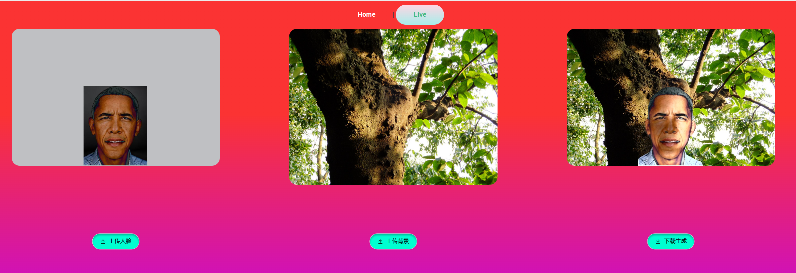

Translated to English: [简体中文](https://www.forefront.ai/app/chat/README.md) | English

We have implemented a relighting course design project with interactive front-end and back-end based on the segmentation model from [PaddleSeg](https://github.com/PaddlePaddle/PaddleSeg) and the DPR algorithm from [DPR](https://github.com/zhhoper/DPR).

**Basic Goals:**

Complete the core algorithm part of the offline module to extract scene lighting and relight portraits.

**Extended Goals:**

Design a UI client that allows users to interact with the system by uploading images.

The server should be able to receive user requests and save images.

The server should be able to successfully invoke the core image stitching algorithm.

The client, server, and core algorithm should be successfully integrated and run without major bugs.

Usage: Install all the required libraries or requirements for [PaddleSeg](https://github.com/PaddlePaddle/PaddleSeg) and [DPR](https://github.com/zhhoper/DPR).

conda create --Paddle --requirements

Note that the version of PaddlePaddle needs to match the CUDA and PyTorch versions.

To use the system, run "python manage.py runserver" in the root directory.

For relighting of portrait videos: Not deployed to the front-end, can be run separately by running the "video_relighting" algorithm.
