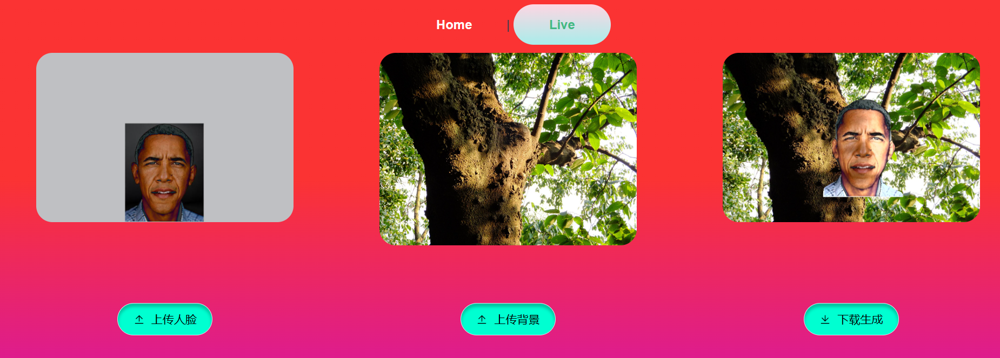

 [简体中文](README_CN.md) | English

We have implemented a relighting course project with interactive frontend and backend based on the segmentation model from [PaddleSeg](https://github.com/PaddlePaddle/PaddleSeg) and the relighting algorithm from [DPR](https://github.com/zhhoper/DPR).

**Primary Objectives:**

Complete the core algorithm of the offline module, extract scene lighting, and relight portraits.

**Additional Objectives:**

Design a UI client that allows user interaction and image uploads.

Enable the server to receive user requests and save images.

Ensure the server can smoothly invoke the core image stitching algorithm.

Ensure seamless integration and successful execution of the client, server, and core algorithm without any significant bugs.

Usage instructions: Install all the required libraries for [PaddleSeg](https://github.com/PaddlePaddle/PaddleSeg) and [DPR](https://github.com/zhhoper/DPR).

To use, navigate to the PaddleSeg folder and run "python manage.py runserver."

For relighting on portrait videos: Work in progress.

